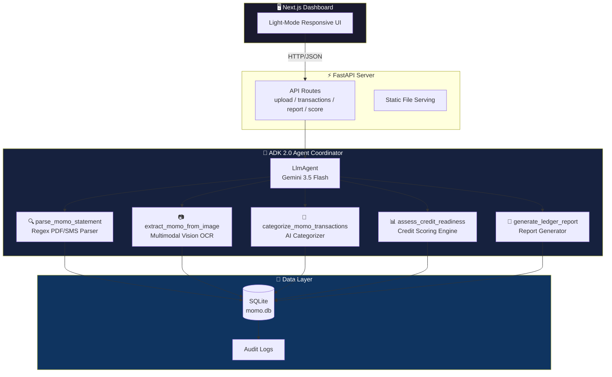
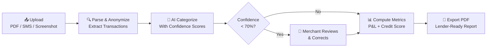

<div align="center">

# 🏦 MoMo Ledger

**AI-Powered Financial Statements & Credit Profiling for Ghana's Informal Economy**

[](https://python.org)
[](https://nextjs.org)
[](https://google.github.io/adk-docs/)
[](https://deepmind.google/technologies/gemini/)
[](https://cloud.google.com/run)
[](LICENSE)

*Transforming Mobile Money transaction data into lender-ready financial statements and explainable credit profiles for micro, small, and medium enterprises (MSMEs) across Ghana.*

[Features](#-features) · [Architecture](#-architecture) · [Quick Start](#-quick-start) · [Demo](#-live-demo) · [Documentation](#-documentation)

</div>

---

## 📋 Table of Contents

- [The Problem](#-the-problem)
- [The Solution](#-the-solution)
- [Features](#-features)
- [Architecture](#-architecture)
- [Credit Scoring Model](#-credit-scoring-model)
- [User Flow](#-user-flow)
- [Project Structure](#-project-structure)
- [Tech Stack](#-tech-stack)
- [Quick Start](#-quick-start)
- [Deployment](#-deployment)
- [Security & Privacy](#-security--privacy)
- [Documentation](#-documentation)
- [Author](#-author)
- [License](#-license)

---

## 🎯 The Problem

**70% of Ghana's economy is informal.** Millions of MSMEs — market traders, food vendors, freelancers, and micro-distributors — depend entirely on **Mobile Money (MTN MoMo)** for daily business transactions. Yet these merchants are locked out of formal credit markets because they lack one critical thing: **financial statements.**

Banks require P&L reports, cash flow summaries, and credit histories that these hardworking entrepreneurs simply don't have. Meanwhile, Ghana has over **18 million active MoMo accounts** (Bank of Ghana, 2024) — a treasure trove of transaction data sitting unused.

**The gap is clear:** merchants have the digital transaction history to prove their business viability, but no way to convert it into the financial language banks understand.

---

## 💡 The Solution

**MoMo Ledger** is an AI agent that bridges this gap. It accepts raw Mobile Money data in any format — PDF statements, SMS text logs, or smartphone screenshots — and automatically transforms them into:

- 📊 **Profit & Loss Statements** with categorized income and expenses
- 💰 **Cash Flow Summaries** with trend analysis
- 📈 **Credit Readiness Assessments** with an explainable 0–100 score
- 📄 **Lender-Ready PDF Reports** that merchants can present to banks

Built with **Google ADK 2.0** and **Gemini 3.5 Flash**, MoMo Ledger uses AI agent orchestration — not simple form processing — to intelligently parse, categorize, score, and report on financial data.

---

## ✨ Features

| Feature | Description |
|---------|-------------|
| 📱 **Multi-Format Ingestion** | Upload MoMo PDF statements, paste SMS/text logs, or upload phone screenshots — supports simultaneous multi-file upload |
| 🤖 **AI-Powered Categorization** | Gemini 3.5 Flash classifies transactions into business categories (Sales, Inventory, Logistics, Utilities, Salaries, Taxes) with confidence scores |
| 👤 **Human-in-the-Loop Review** | Low-confidence (<70%) classifications are flagged on the dashboard for merchant correction |
| 📈 **Credit Readiness Scoring** | 5-factor weighted model producing a 0–100 score with GREEN/AMBER/RED indicators |
| 📊 **P&L and Cash Flow Reports** | Automated financial statement generation from raw transaction data |
| 📄 **Lender-Ready PDF Export** | Professional PDF reports with color-coded credit indicators via ReportLab |
| 🔒 **PII Protection** | Phone numbers and personal names auto-redacted during parsing |
| 📝 **Immutable Audit Trail** | All database mutations logged to `audit_logs` table with JSON serialization |
| 🛡️ **STRIDE Threat Model** | Documented security assessment covering all six threat categories |
| 🚀 **Keyless CI/CD** | GitHub Actions → Cloud Run via Workload Identity Federation (no JSON service account keys) |

---

## 🏗️ Architecture

MoMo Ledger uses a **single-agent coordinator pattern** built on Google ADK 2.0, where one LLM agent orchestrates five specialized tool-based skills:



The frontend and backend are packaged into a **single unified Docker container** for Cloud Run deployment. The Next.js app is statically exported and served by FastAPI's `StaticFiles` middleware on the same port.

---

## 📊 Credit Scoring Model

The system calculates a credit readiness score (0–100) using a multi-factor weighted framework:

| Factor | Description | Max Points |
|--------|-------------|:----------:|
| **Base Score** | Default starting rating | 45 |
| **Transaction Volume** | +15 if inflows > GHS 1,000; +30 if > GHS 3,000 | 30 |
| **Cash-Flow Stability** | +15 if total inflows exceed total outflows | 15 |
| **Expense-to-Revenue Ratio** | +15 if expenses < 45% of revenue | 15 |
| **Transaction Frequency** | +10 if ≥ 8 transactions in statement period | 10 |

### Readiness Levels

| Level | Score Range | Meaning |
|-------|:-----------:|---------|
| 🟢 **GREEN** | ≥ 75 | High readiness — positive margins, healthy cash flow, high lending viability |
| 🟡 **AMBER** | 50 – 74 | Medium readiness — positive cash flow but high expenses or low volumes |
| 🔴 **RED** | < 50 | Low readiness — insufficient inflows, net deficit, or high default risk |

---

## 🔄 User Flow



---

## 📁 Project Structure

```
momo-ledger/
├── app/
│   ├── agents/
│   │   ├── coordinator.py          # ADK 2.0 agent + App definition
│   │   └── tools/
│   │       ├── parser.py           # MoMo statement text parser (regex)
│   │       ├── vision_parser.py    # Gemini multimodal OCR
│   │       ├── categorizer.py      # AI transaction categorizer
│   │       ├── profiler.py         # Credit readiness scorer
│   │       └── exporter.py         # Ledger report generator
│   ├── api/
│   │   └── routes.py               # FastAPI endpoints
│   ├── core/
│   │   └── database.py             # SQLite data access layer
│   ├── services/
│   │   ├── pdf_generator.py        # ReportLab PDF export service
│   │   └── scoring.py              # Credit scoring business logic
│   └── fast_api_app.py             # FastAPI application factory
├── frontend/
│   └── src/app/page.tsx            # Next.js React dashboard
├── tests/                          # Unit and integration tests
├── .github/workflows/
│   ├── pr_checks.yaml              # Lint + test on PRs
│   ├── staging.yaml                # Auto-deploy to staging
│   └── deploy-to-prod.yaml         # Production promotion
├── Dockerfile                      # Multi-stage unified build
├── SPEC.md                         # Product requirements document
├── project-writeup.md              # Technical system writeup
├── threat_model.md                 # STRIDE security assessment
├── dev-logs.md                     # Development chronology
└── pyproject.toml                  # Dependencies & tooling config
```

---

## 🛠️ Tech Stack

| Layer | Technology |
|-------|-----------|
| **AI Agent** | Google ADK 2.0 (`LlmAgent`, `App`) |
| **LLM** | Gemini 3.5 Flash (multimodal) |
| **Backend** | FastAPI + Uvicorn |
| **Frontend** | Next.js 16 (React, TypeScript) |
| **Database** | SQLite (local-first, privacy-compliant) |
| **PDF Generation** | ReportLab |
| **CI/CD** | GitHub Actions + Workload Identity Federation |
| **Deployment** | Google Cloud Run (single container) |
| **Linting** | Ruff, ty, codespell |
| **Package Management** | uv (Astral) |

---

## 🚀 Quick Start

### Prerequisites

- **Python 3.10+**
- **Node.js 20+**
- **[uv](https://docs.astral.sh/uv/)** — Python package manager
- **[Google Cloud SDK](https://cloud.google.com/sdk/docs/install)** — for Gemini API access

### Installation

```bash
# Clone the repository
git clone https://github.com/Hou-dini/momo-ledger.git
cd momo-ledger

# Install Python dependencies
make install

# Install frontend dependencies
cd frontend && npm ci && cd ..

# Set up Google Cloud credentials
gcloud auth application-default login

# Run backend (terminal 1)
make playground

# Run frontend (terminal 2)
cd frontend && npm run dev
```

Open [http://localhost:3000](http://localhost:3000) to access the dashboard.

### Docker (Production Build)

```bash
docker build -t momo-ledger .
docker run -p 8080:8080 momo-ledger
```

### Commands

| Command | Description |
|---------|-------------|
| `make install` | Install Python dependencies via uv |
| `make playground` | Launch local development server |
| `make lint` | Run Ruff, ty, and codespell checks |
| `make test` | Run unit and integration tests |

---

## ☁️ Deployment

MoMo Ledger deploys automatically to **Google Cloud Run** via GitHub Actions with **Workload Identity Federation** (keyless, no JSON service account keys):

| Trigger | Pipeline | Target |
|---------|----------|--------|
| Pull Request | `pr_checks.yaml` | Lint + Test |
| Merge to `main` | `staging.yaml` | Cloud Run (Staging) |
| Manual dispatch | `deploy-to-prod.yaml` | Cloud Run (Production) |

The deployment uses OIDC-based authentication — GitHub Actions retrieves short-lived access tokens from GCP dynamically, scoped exclusively to the `Hou-dini/momo-ledger` repository.

---

## 🔒 Security & Privacy

| Measure | Implementation |
|---------|---------------|
| **PII Anonymization** | Phone numbers and personal names stripped during initial parsing |
| **Immutable Audit Log** | All DB mutations tracked in `audit_logs` table with JSON snapshots |
| **STRIDE Threat Model** | Comprehensive assessment documented in [`threat_model.md`](threat_model.md) |
| **CORS Protection** | Explicit origin allowlists (no wildcard + credentials) |
| **Tool Boundary Isolation** | Agent only has access to registered business tools — no admin capabilities |
| **Keyless CI/CD** | Workload Identity Federation eliminates long-lived credentials |

---

## 📚 Documentation

| Document | Description |
|----------|-------------|
| [`SPEC.md`](SPEC.md) | Product requirements and prototype specification |
| [`project-writeup.md`](project-writeup.md) | Technical system writeup (architecture, scoring, CI/CD) |
| [`threat_model.md`](threat_model.md) | STRIDE security threat assessment |
| [`dev-logs.md`](dev-logs.md) | Development chronology and troubleshooting logs |
| [`AGENTS.md`](AGENTS.md) | AI-assisted development guide |

---

## 👤 Author

**Elikplim Kudowor**

Applied AI Engineer & Multi-Agent Systems Architect

- 🐙 GitHub: [@Hou-dini](https://github.com/Hou-dini)
- 💼 LinkedIn: [elikplim-kudowor](https://www.linkedin.com/in/elikplim-kudowor/)
- 📍 Accra, Ghana

---

## 📄 License

This project is licensed under the **Apache License 2.0** — see the [LICENSE](LICENSE) file for details.

---

<div align="center">

**MoMo Ledger** — *Turning mobile money into financial opportunity.* 🇬🇭

</div>
