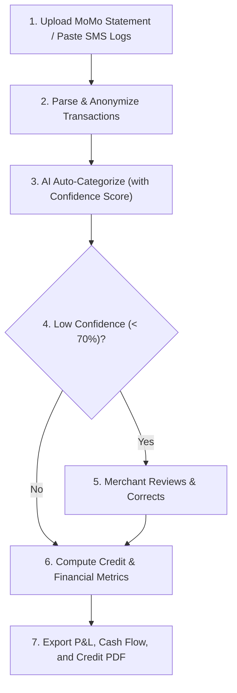

# MoMo Ledger: Prototype Specification Document (SPEC.md)

This document synthesizes the Product Requirements Document (PRD) and Technical Specification for **MoMo Ledger**—an AI-driven financial statement and credit-profiling engine for micro, small, and medium enterprises (MSMEs) in Ghana.

---

## 1. Prototype Overview & Scope

### Primary Goal
To transform raw Mobile Money (MTN MoMo) transaction logs into lender-ready financial statements (Profit & Loss statements and Cash Flow summaries) and an explainable credit profile score.

### Target Audience
Informal Ghanaian MSMEs (market traders, food vendors, freelancers, retailers, micro-distributors) who rely entirely on mobile money for business transactions but lack formal accounting books, locking them out of formal credit markets.

### MVP Scope Bounds
* **Included (In-Scope)**:
  * Uploading MTN MoMo transaction PDF statements, screenshots, or raw text logs.
  * PDF text extraction and parsing.
  * Transaction normalization (date, amount, transaction ID, type, party).
  * AI-powered expense and income categorization with confidence scores.
  * Automatic generation of Profit & Loss (P&L) statements and Cash Flow summaries.
  * Rule-based Credit Score generation (0–100 scale).
  * Interactive human-in-the-loop dashboard to review and correct low-confidence classifications.
  * Exporting lender-ready PDF financial reports.
* **Deferred (Out-of-Scope / Future Roadmap)**:
  * Live bank/teleco APIs (Telecel Cash, AT Money).
  * Tax filing automation.
  * Direct commercial banking core integrations.
  * Real-time ledger synchronization.

---

## 2. User Journey & Core Flow

1. **Upload**: Merchant uploads an MTN MoMo statement, screenshots, or pastes transaction SMS records.
2. **Parsing**: The backend parses the data, isolates transaction rows, and strips PII.
3. **AI Classification**: The AI agent classifies transactions, tagging each with a category and confidence level.
4. **Human-in-the-Loop Review**: Low-confidence items (<70% confidence) are flagged on a dashboard for the merchant to confirm or correct.
5. **Reporting**: The engine aggregates verified records to generate P&L, cash flow sheets, and the credit profile.
6. **Export**: The merchant reviews the dashboard and downloads a formatted PDF statement.

---

## 3. System Architecture & API Design

### Stack Architecture
* **Frontend**: React / Next.js (clean, mobile-responsive layout for easy access).
* **Backend API**: FastAPI (Python).
* **AI Orchestration**: Google ADK (Agent Development Kit) 2.0.
* **Data Storage**: SQLite (local embedded file `momo.db` for rapid prototyping and local-first compliance) + Local filesystem (for secure document uploads).
* **Reporting Engine**: Python-based report compiler and PDF generator.

### API Endpoints
* `POST /upload`: Upload statement documents (PDF/Screenshots/TXT) or paste SMS strings.
* `GET /transactions/{id}`: Retrieve parsed and categorized rows for a merchant.
* `POST /review`: Submit merchant corrections for low-confidence rows.
* `GET /report/{id}`: Compile P&L and Cash Flow summaries.
* `GET /score/{id}`: Compute credit score metrics.

---

## 4. Data Model

### `Transaction`
* `id` (Text/UUID): Unique transaction identifier.
* `merchant_id` (Text): Reference to the business profile.
* `timestamp` (Text): Date and time of transaction.
* `amount` (Real): Value in GHS.
* `direction` (Text): `inflow` (deposit) or `outflow` (withdrawal).
* `counterparty` (Text): Anonymized sender or recipient.
* `category` (Text): Expense or revenue account (e.g., Sales, Inventory, Logistics).
* `confidence` (Real): Confidence score (0.0 to 1.0) of the classification.
* `reviewed_flag` (Integer): 1 if verified by the merchant, 0 otherwise.

### `FinancialSummary`
* `id` (Text/UUID): Summary reference.
* `revenue` (Real): Total business sales.
* `expenses` (Real): Total operating costs.
* `profit` (Real): Net income.
* `cash_flow` (Real): Net cash position change.
* `average_balance` (Real): Calculated average wallet balance.
* `credit_score` (Integer): Final calculated rating (0-100).

---

## 5. Core AI Agent & Skills Design

The system runs as a single-agent coordinator that calls specialized python-based tools (skills) to handle business tasks.

### 5.1 Model Configuration
* **Core Model**: `gemini-3.5-flash` for multimodal parsing and user language translation.

### 5.2 Statement Parsing Tool (Text & Screenshot OCR)
* **Input**: Raw text strings or local screenshot path.
* **Rules**: Extract date, amount, transaction ID, type, and party. Strip out PII (phones, specific names) to enforce data privacy.

### 5.3 Transaction Classification Tool
* **Input**: Transaction description and amount.
* **Rules**: Match against local business categories:
  * **Inflows**: `Sales` (regular merchant receipts), `Capital` (deposits), `Other Inflow`.
  * **Outflows**: `Inventory` (wholesale restocks), `Logistics` (delivery/transport like Bolt/Yango/commercial cargo), `Utilities` (ECG prepaid, water, data bundles), `Salaries` (staff payroll), `Taxes` (GRA collections, E-levy), `Personal` (owner withdrawals).
* **Confidence Metric**: Assign confidence based on keyword matching certainty and LLM validation thresholds.

### 5.4 Credit Scoring Engine
The system calculates a credit score (scale 0-100) using a weighted multi-factor framework:
1. **Transaction Volume (25%)**: Total value and count of monthly inflows.
2. **Consistency (25%)**: Regularity of business deposits over the statement timeline (no long dry spells).
3. **Average Balance (15%)**: Monthly average wallet liquidity.
4. **Supplier Regularity (15%)**: Frequency of payments to recurring supplier accounts (showing stable supply chains).
5. **Cash-Flow Stability (20%)**: Positive margin ratio and controlled outflows (lower risk of defaults).

---

## 6. Security & Data Protection
* **PII Anonymization**: Strip phone numbers and exact names during the initial parsing stage.
* **Data Encryption**: Local file protection; write-operation logs are tracked in an immutable `audit_logs` database table.
* **Consent Verification**: Express user authorization is required before generating or exporting credit statements for third-party lenders.
* **Configurable Deletion**: Secure auto-deletion of raw PDF/Image files immediately after transaction parsing.

---

## 7. Success & Validation Metrics

### Accuracy Targets
* **Auto-Categorization Accuracy**: >70% correct categories on initial parsing.
* **Usable Statements**: 80% of uploaded statements successfully compiled into complete P&L accounts.

### Performance Indicators
* Average processing time under 30 seconds per statement page.
* Reduction of bookkeeping effort for MSME merchants (measured by low rates of manual correction overrides).
